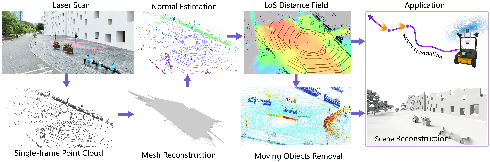

# Real-Time Spatial Reasoning by Mobile Robots for Reconstruction and Navigation in Dynamic LiDAR Scenes

<a href="https://wiki.ros.org/noetic"></a>
<a href="https://ieeexplore.ieee.org/xpl/RecentIssue.jsp?punumber=6979"></a>
<a href="LICENSE"></a>

<!-- <a href="https://github.com/huggingface/accelerate"></a> -->
<!-- <a href="https://wandb.ai/site"></a> -->

**This repository is the official repository of the paper, *Real-Time Spatial Reasoning by Mobile Robots for Reconstruction and Navigation in Dynamic LiDAR Scenes*.**

[Pengdi Huang](https://github.com/alualu628628),
[Mingyang Wang](https://github.com/Marmiya),
[Huan Tian](https://github.com/LogicT5),
[Minglun Gong](https://socs.uoguelph.ca/~minglun/),
[Hao (Richard) Zhang](https://www.cs.sfu.ca/~haoz/),
[Hui Huang](https://vcc.tech/~huihuang)

[VCC](https://vcc.tech/), 
[CSSE](https://csse.szu.edu.cn/),
[Shenzhen University](https://www.szu.edu.cn/)


<!-- ### [Project Page](https://vcc.tech/research/2025/CLRWire) | [Paper (ArXiv)](https://www.arxiv.org/abs/2504.19174) -->
### [Paper (ArXiv)(Will be improved later)]()



## :movie_camera:Demos
<!-- <video src="assets/RealRecon_demo_1.mp4" controls="controls" style="min-width: 640px; min-height: 360px;"></video> -->

<!-- <video src="assets/RealRecon_demo_2.mp4" controls="controls" style="min-width: 640px; min-height: 360px;"></video> -->

<!-- <video src="assets/RealRecon_demo_3.mp4" controls="controls" style="min-width: 640px; min-height: 360px;"></video> -->

Our accompanying videos are now available on **YouTube** (click below images to open).
 <!-- and [**Bilibili**]() -->

<div align="center">
    <a href="https://www.youtube.com/watch?v=t4Y_ba83do0&list=PL0kFXLVQr3BXX21FbksfL5wbAzqrE98lV" target="_blank">
        <!-- <video src="assets/RealRecon_demo_start.mp4" alt="video" style="min-width: 640px; min-height: 360px;"   autoplay loop ></video> -->
        
    </a>
</div>

## Download data and checkpoints
We provide data for seven scenarios, which you can download with [Google Drive](https://drive.google.com/drive/folders/14ytehOFQZ0S7-BlmEvs3l2cmZCsVoHTn?usp=drive_link).

## Installation
### Ubuntu and ROS
Our project is based on ROS Noetic. Please install ROS first on Ubuntu 20.04 Follow [ROS Installation](https://wiki.ros.org/noetic/Installation/Ubuntu).

### Environment Configuration
(1) **Install Ceres Solver**, refer to the [official Ceres Solver documentation](http://ceres-solver.org/installation.html) (we recommended version: 1.14.0).
<details>
  <summary>:arrow_forward: Install Ceres Solver with bash</summary>

    # git ceres-solver1.14.0
    git clone --branch ceres-solver-1.14.0 --single-branch https://github.com/LogicT5/Tools.git ceres-solver-1.14.0
    # CMake
    sudo apt-get install cmake
    # google-glog + gflags
    sudo apt-get install libgoogle-glog-dev libgflags-dev
    # Use ATLAS for BLAS & LAPACK
    sudo apt-get install libatlas-base-dev
    # Eigen3
    sudo apt-get install libeigen3-dev
    # SuiteSparse (optional)
    sudo apt-get install libsuitesparse-dev
    #
    tar -zxvf ceres-solver-1.14.0.tar.gz -C ./ceres && cd ceres
    # build
    mkdir build && cd build
    cmake ..
    make -j4
    make test
    sudo make install

</details>

(2) **Install PCL**, refer to the [PCL](https://pointclouds.org/downloads/#linux).
<details>
  <summary>:arrow_forward: Install PCL with bash</summary>

    sudo apt-get install libpcl-dev

</details>

(3) **Install CGAL**, refer to the [CGAL](https://www.cgal.org/download/linux.html).
<details>
  <summary>:arrow_forward: Install PCL with bash</summary>

    sudo apt-get install libcgal-dev

</details>

(4) **Install Embree**, refer to [Intel Embree](https://www.embree.org/).


## Usage

### Build the project
First, Init workspace and Clone the repository:
```
mkdir ~/catkin_ws && cd catkin_ws 
git clone https://github.com/SZU-VCC/RTRecon.git src #Clone the repository and rename it to src
```

Second, The system requires a SLAM method to register the point cloud, such as [ALOAM](https://github.com/HKUST-Aerial-Robotics/A-LOAM)( Download ALOAM into the ~/catkin_ws/src ).

Finally, build the project in the workspace(catkin_ws):
```
catkin_make -DCMAKE_BUILD_TYPE=Release 
source ~/catkin_ws/devel/setup.bash
```

### Run with bag
Start the following nodes in sequence. The ```simple_frame``` is used for reconstruct single-frame scan, ```hash_fusion``` is for marking free space from a single frame, fusing the LoS distance field between multiple frames, and detecting and removing moving objects. ```fusion_recon``` is used for multi-frame reconstruction.

1. Start the SLAM node, example as ALOM: 
```
roslaunch  aloam_velodyne aloam_velodyne.launch
```
2. Start the ```simple_frame``` node: 
```
roslaunch  simple_frame reconstruction.launch
```
3. Start the ```hash_fusion``` node: 
```
roslaunch  hash_fusion hash_fusion.launch
```
4. Start the ```fusion_recon``` node: 
```
roslaunch  fusion_recon fusion_recon.launch
```
5. Start playing a bag: 
```
rosbag play /path/to/YOURBAG.bag
```
<details>
  <summary>:heavy_exclamation_mark: Tips</summary>

> **If your system fails to operate as expected, please proceed with the following diagnostic steps:**  
> 1. Inspect the TF tree and verify that the world frame is set to either ```/odom``` or ```/map```; You can use the following command to unify the frames: \
> ```rosrun tf static_transform_publisher 0 0 0 0 0 0 /camera_init /odom 10``` \
> ```rosrun tf static_transform_publisher 0 0 0 0 0 0 /map /odom 10``` 
> 2. Ensure that the topic names specified in ```reconstruction.launch``` align with those published by the SLAM node.

</details>

## :notebook_with_decorative_cover: Citation
If you find our work useful for your research, please consider citing the following papers(Will be improved later) :
```
@article{RTRecon,
    author={Pengdi Huang and Mingyang Wang and Huan Tian and Minglun Gong and Hao Zhang and Hui Huang},
    title={Real-Time Spatial Reasoning by Mobile Robots for Reconstruction and Navigation in Dynamic LiDAR Scenes}
}
```
## :email: Contact
This repo is currently maintained by Huan Tian and is for academic research use only. Discussions and questions are welcome via thndy000@gmail.com. 
